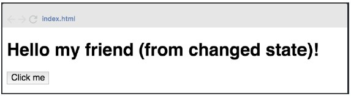

# Ejercicios React - Rolling Code School 
Prácticas con componentes, ciclo de vida del componente, eventos etc.

## Ejercicio N°3: Hello world (parte 3)- Dificultad: 🟢

Modificar el programa anterior agregando al componente un state con la clave msj:
“(from changed state)”, además agregar un botón al presionar este botón (onClick),
el state de la clave msj se debe mostrar por pantalla de la siguiente manera:

 

### Link de Deploy:
- [Netlify](https://lucasecapdevila-tpn2react76i.netlify.app/)